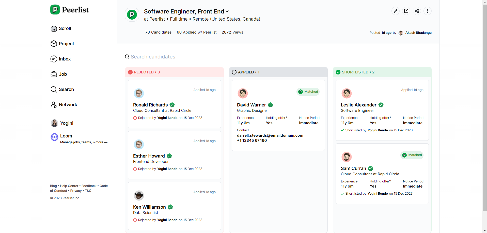
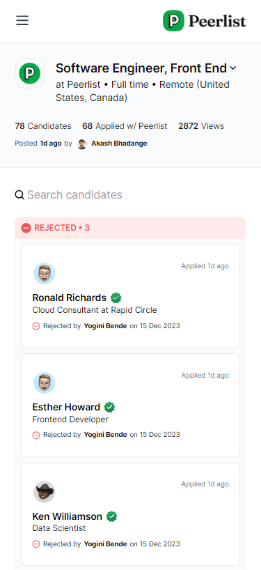

# <u> Peerlist Dashboard - a Frontend Assignment 💚 </u>

This Peerlist assignment is a candidate management single page application that allows you to organize job applicants into different categories such as <b> Applied, Rejected, and Shortlisted.</b> The application includes two key functionalities: drag and drop cards with dynamic content changes based on category, and search functionality for candidates by email, name, company, and mobile number. 

<i>Note: I have used dummy data for cards.</i>
## How it is built 👩‍💻?
The dashboard was developed using the following technologies: 
- Next Js for Frontend
- Tailwind CSS for styling 
- Hosted on Github 
- Deployed on Vercel 

## Features 🤩
 - Drag and drop cards between categories to update candidate status
 - Dynamically change card content based on category
- Search for candidates by email, name, company, or mobile number  
   
 - Fully responsive design for mobile and desktop devices   
 

## Installation 🎁
To run the Peerlist assignment locally, follow these steps:

1. Clone the repository: `git clone https://github.com/yourusername/peerlist-assignment.git`
2. Navigate to the project directory: `cd peerlist-assignment`
3. Install dependencies: `npm install`
4. Start the development server: `npm run dev`

## Link links 🔗
Github: [Peerlist Assignment](https://github.com/snehafarkya/peerlist-assignment)
Deployed Link: [Live here](https://peerlist-assignment-one.vercel.app/)

Have a great day🌻!